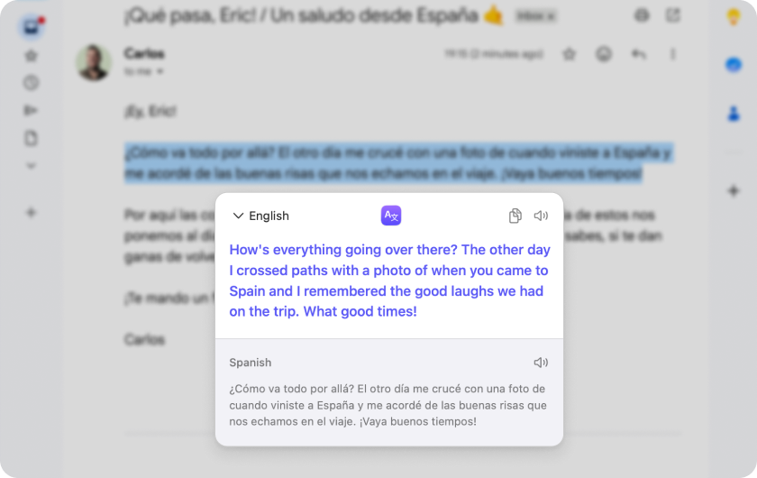

<p align="center">
  
</p>

<h1 align="center">SelectTranslate</h1>

<p align="center">Select text in any Mac app, click the button, read it in your language. Translation happens on your Mac.</p>

<p align="center">
  <a href="https://github.com/luke-th/SelectTranslate/releases/latest">
    
  </a>
</p>

<p align="center">
  
</p>

---

Reading in another language on a Mac means copying text into a translator and back again. SelectTranslate puts a small **Translate** button next to whatever you just selected. Click it and a bubble shows the translation, powered by Apple's on-device Translation framework — no account, no subscription, nothing sent anywhere. For languages you haven't downloaded yet, an optional [OpenRouter](https://openrouter.ai) key gets you an instant online translation instead.

## Features

- **Select → Translate.** A button appears next to any selection, in any app, after a delay you choose. Click it, or press ⌥⌘T, or hit ⌘C twice.
- **On-device.** Apple Translation handles 20 languages offline once a language pack is downloaded — Thai, Japanese, Chinese, Spanish, German, French, Korean, Vietnamese, Arabic and more.
- **Knows the direction.** Foreign text goes into your language. Turn on a second language and text that's already in your language is translated into the one you're learning — and back.
- **Online when it helps.** Add an OpenRouter key and languages without a downloaded pack are translated instantly by the model you pick, streamed into the bubble. The bubble says when that happened and offers to download Apple's offline pack for languages you meet often. Add your own instructions ("keep product names in English").
- **A tidy bubble.** Translation on top, original below, copy and speak-aloud on hover, switch the target language on the fly, resizable text.
- **Stays out of the way.** No Dock icon. Exclude apps where you never want the button. Nothing appears when the text is already in your language.
- **Updates itself.** Checks for new versions via Sparkle; turn it off in Settings if you prefer.

## Install

[Download the latest DMG](https://github.com/luke-th/SelectTranslate/releases/latest), open it, and drag SelectTranslate to Applications. Older versions are under [Releases](https://github.com/luke-th/SelectTranslate/releases).

Requires macOS 15 or later. Builds aren't notarized by Apple yet, so on first launch go to **System Settings → Privacy & Security** and click **Open Anyway** (or run `xattr -d com.apple.quarantine /Applications/SelectTranslate.app`). The app then asks for **Accessibility** access — that's how it reads the text you select. Nothing you type is recorded.

The first time you translate a new language, macOS asks to download its language pack (a one-time, small download). Packs can be managed in System Settings → General → Language & Region → Translation Languages.

## Privacy

Apple's Translation framework runs entirely on your Mac. SelectTranslate makes network requests in exactly two cases, both optional: a daily check of the update feed on GitHub (Sparkle; off in Settings), and — only if you add an OpenRouter key — sending the selected text to OpenRouter and the model provider you chose, when Apple can't translate it offline. The bubble always says when a translation went online. Your API key is stored in the macOS Keychain; settings live in the app's own defaults.

## Building from source

Requirements: the Xcode Command Line Tools (`xcode-select --install`). Xcode itself is not needed. Dependencies — [SelectedTextKit](https://github.com/tisfeng/SelectedTextKit), [Sparkle](https://sparkle-project.org) and a vendored copy of [KeyboardShortcuts](https://github.com/sindresorhus/KeyboardShortcuts) — are fetched by Swift Package Manager on first build.

```bash
git clone https://github.com/luke-th/SelectTranslate.git
cd SelectTranslate
make install        # release build → build/SelectTranslate.app → /Applications
```

Other targets: `swift build` (debug binary), `make app` (build only), `make dmg` (universal DMG). `scripts/build-app.sh` assembles the `.app` — copies Sparkle.framework in, signs its helpers, then the app. Local builds are ad-hoc signed with a stable, identifier-based designated requirement so macOS keeps the Accessibility grant across rebuilds; set `CODESIGN_IDENTITY="Developer ID Application: …"` to sign for real.

`scripts/release.sh <version>` bumps the version, builds the universal DMG, signs it with the Sparkle EdDSA key and regenerates `appcast.xml`; with `--publish` it tags and creates the GitHub release that installed copies poll. See the comments at the top of that script for the one-time key setup.

## How it works

A global mouse monitor spots a drag-select or double-click. After the configured delay the selection is read through the Accessibility API (with a quiet *Copy*-menu fallback for apps with poor accessibility support, courtesy of SelectedTextKit), and its on-screen bounds place the button. `NLLanguageRecognizer` guesses the language to decide direction; Apple's `TranslationSession` translates on-device. On macOS 15 the session is obtained through a hidden SwiftUI view, on macOS 26 it's created directly. With an OpenRouter key, pairs whose pack isn't installed go to the chat-completions API instead, streamed token by token.

## Acknowledgements

- [SelectedTextKit](https://github.com/tisfeng/SelectedTextKit) by tisfeng (MIT) — reading the selected text and its bounds through Accessibility, with its dependencies [AXSwift](https://github.com/tisfeng/AXSwift) (MIT) and [KeySender](https://github.com/jordanbaird/KeySender) (MIT)
- [KeyboardShortcuts](https://github.com/sindresorhus/KeyboardShortcuts) by Sindre Sorhus (MIT), vendored in `Vendor/`
- [Sparkle](https://sparkle-project.org) (MIT) for updates

## License

[MIT](LICENSE)
